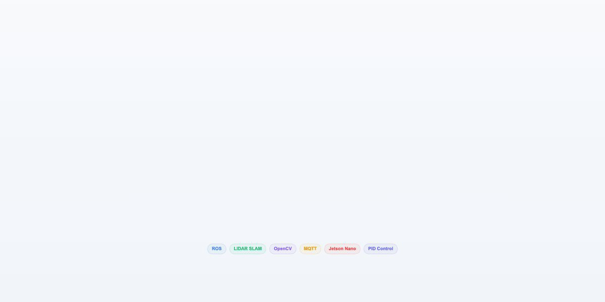

# MediBot

MediBot is an autonomous medical assistance robot built on multiple hardware platforms including Arduino, ESP32, and NVIDIA Jetson Nano.

In normal mode, it smartly patrols over the buildings, collecting ambient data including temperature, humidity, and air quality data. Additionally, it can perform contactless fever screening and monitor mask compliance. Data will be analyzed and displayed through a user-end web interface in real-time. Meanwhile, an operator can play pre-recorded audio announcements and control the robot's movement manually (when needed) remotely via the web control panel.

Upon detecting smoke or fire, it will transition to emergency mode, play audio alerts to the public and simultaneously send the notifications to operators who can manually dismiss emergency once it is clear.

https://github.com/user-attachments/assets/9a6b4d10-532c-44e1-a109-206e84b807f9

<p align="center">
  
</p>

## System Overview

**Compute** Jetson Nano (vision, LIDAR, MQTT orchestration) + Arduino (motor control, encoder odometry) + ESP32 (WiFi sensor publishing)

**Navigation** 4-wheel mecanum omnidirectional drive with PID control, LIDAR-based SLAM via ROS GMapping/AMCL, autonomous path planning with move_base

**Perception** Haar cascade face detection with HSV-based mask classification, MLX90640 thermal imaging for fever screening, BME280 temperature/humidity, MQ-135 air quality

**Web Interface** Real-time sensor dashboard with Chart.js, remote motor control, live camera feed with detection overlay, thermal display, emergency alert page

## Navigation Pipeline

```
Arduino encoders -> Serial (vx, vy, vth @ 20Hz)
    -> real_odom_publisher.py -> TF + /odom
    -> GMapping/AMCL (LIDAR + odometry fusion)
    -> move_base -> /cmd_vel -> Arduino motor control
```

To start mapping: `roslaunch mapping.launch`
To start navigation: `roslaunch navigation.launch`

## Project Structure

```
Arduino/            Mecanum drive, PID, encoder odometry
ESP32Module/        WiFi + MQTT sensor publishing (BME280, MQ-135)
JetsonNano/
  main.py           MQTT message router, LIDAR visualization, mode management
  mask_detection.py Haar cascade + HSV mask classification
  MLX90640.py       Thermal camera interface
  Stream.py         Video streaming over MQTT
  RosMap&Navi/      ROS package (GMapping, AMCL, move_base, odom publisher)
    maps/           Pre-built hospital lab map
UserDevice(Web)/
  index.html        Sensor dashboard with live charts
  control.html      Remote motor control panel
  heat.html         Thermal imaging display
  abnormal.html     Emergency alert interface
```

<details>
<summary>Prerequisites</summary>

### Hardware
- NVIDIA Jetson Nano
- Arduino Board with 4x mecanum wheels + encoders
- ESP32 with BME280 + MQ-135
- Camera module
- MLX90640 thermal camera
- YDLidar

### Software

Jetson Nano: Ubuntu 18.04, Python 3.6, OpenCV, paho-mqtt, pygame, ROS Melodic (gmapping, move-base, amcl, map-server, dwa-local-planner, tf2-ros), YDLidar SDK + ROS driver

Arduino: Encoder library, PID library

ESP32: Adafruit BME280, PubSubClient, WiFi

Web: Modern browser (Chart.js and MQTT.js loaded from CDN)
</details>
